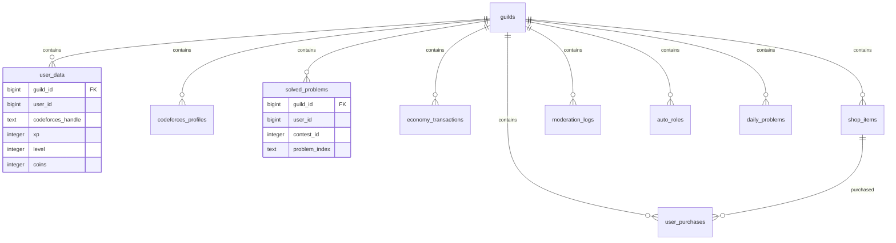

# Database Schema Design

A comprehensive overview of the PostgreSQL database schema for the competitive programming Discord bot, designed for scalability and multi-server support.

## 🏗️ Architecture Overview

The database uses a **hybrid relational + JSON** approach:
- **Relational structure** for core data with relationships
- **JSONB columns** for flexible configuration and metadata
- **Single database** serving multiple Discord servers
- **Guild-based isolation** ensuring data separation between servers

## 📊 Core Tables

### 1. Guild Configuration (`guilds`)

Stores server-specific settings and configurations.

```sql
CREATE TABLE guilds (
    guild_id BIGINT PRIMARY KEY,              -- Discord server ID
    name TEXT NOT NULL,                       -- Server name
    created_at TIMESTAMP DEFAULT NOW(),      -- When bot joined server
    updated_at TIMESTAMP DEFAULT NOW(),      -- Last configuration update
    config JSONB DEFAULT '{}',               -- Flexible configuration
    is_active BOOLEAN DEFAULT TRUE           -- Server active status
);

CREATE INDEX idx_guilds_active ON guilds(is_active);
CREATE INDEX idx_guilds_config ON guilds USING GIN(config);
```

#### Configuration Schema (JSONB)

```json
{
  "prefix": "!",
  "welcome": {
    "channel_id": 123456789012345,
    "message": "Welcome to our competitive programming community!",
    "auto_role": 987654321098765
  },
  "systems": {
    "xp_enabled": true,
    "economy_enabled": true,
    "auto_moderation": true,
    "codeforces_sync": true
  },
  "channels": {
    "daily_problem": 123456789012345,
    "leaderboard": 123456789012346,
    "announcements": 123456789012347
  },
  "rewards": {
    "problem_base": 1,
    "streak_bonus": 0.5,
    "contest_multiplier": 2.0
  },
  "moderation": {
    "warn_limit": 3,
    "auto_ban": false,
    "filter_enabled": true
  }
}
```

### 2. User Data (`user_data`)

Per-server user information including XP, coins, and progress.

```sql
CREATE TABLE user_data (
    id BIGSERIAL PRIMARY KEY,
    guild_id BIGINT NOT NULL REFERENCES guilds(guild_id) ON DELETE CASCADE,
    user_id BIGINT NOT NULL,                 -- Discord user ID
    username TEXT,                           -- Discord username (cached)
    
    -- Experience & Leveling
    xp INTEGER DEFAULT 0,
    level INTEGER DEFAULT 1,
    
    -- Economy System
    coins INTEGER DEFAULT 0,
    total_earned INTEGER DEFAULT 0,         -- Lifetime coins earned
    
    -- Activity Tracking
    last_active TIMESTAMP DEFAULT NOW(),
    join_date TIMESTAMP DEFAULT NOW(),
    message_count INTEGER DEFAULT 0,
    
    -- Competitive Programming
    codeforces_handle TEXT,
    problems_solved INTEGER DEFAULT 0,
    current_streak INTEGER DEFAULT 0,
    max_streak INTEGER DEFAULT 0,
    last_solve_date DATE,
    
    -- Moderation
    warns INTEGER DEFAULT 0,
    is_banned BOOLEAN DEFAULT FALSE,
    
    -- Flexible metadata
    metadata JSONB DEFAULT '{}',
    
    created_at TIMESTAMP DEFAULT NOW(),
    updated_at TIMESTAMP DEFAULT NOW(),
    
    UNIQUE(guild_id, user_id)
);

CREATE INDEX idx_user_data_guild_user ON user_data(guild_id, user_id);
CREATE INDEX idx_user_data_codeforces ON user_data(codeforces_handle) WHERE codeforces_handle IS NOT NULL;
CREATE INDEX idx_user_data_xp ON user_data(guild_id, xp DESC);
CREATE INDEX idx_user_data_coins ON user_data(guild_id, coins DESC);
CREATE INDEX idx_user_data_active ON user_data(last_active);
```

#### User Metadata Schema (JSONB)

```json
{
  "achievements": ["first_solve", "streak_7", "expert_level"],
  "preferences": {
    "difficulty_range": [800, 1600],
    "favorite_tags": ["dp", "graphs", "math"],
    "daily_reminders": true
  },
  "statistics": {
    "avg_solve_time": 2340,
    "favorite_language": "C++",
    "best_rating_gain": 150
  },
  "social": {
    "mentor": 123456789,
    "mentees": [987654321, 456789123]
  }
}
```

### 3. Codeforces Profiles (`codeforces_profiles`)

Detailed Codeforces user information and statistics.

```sql
CREATE TABLE codeforces_profiles (
    id BIGSERIAL PRIMARY KEY,
    guild_id BIGINT NOT NULL REFERENCES guilds(guild_id) ON DELETE CASCADE,
    user_id BIGINT NOT NULL,
    handle TEXT NOT NULL,                    -- Codeforces handle
    
    -- Profile Information
    first_name TEXT,
    last_name TEXT,
    country TEXT,
    city TEXT,
    organization TEXT,
    
    -- Competition Stats
    current_rating INTEGER DEFAULT 0,
    max_rating INTEGER DEFAULT 0,
    rank TEXT,                              -- pupil, specialist, expert, etc.
    max_rank TEXT,
    
    -- Activity Stats
    contribution INTEGER DEFAULT 0,
    friend_of_count INTEGER DEFAULT 0,
    last_online_time TIMESTAMP,
    registration_time TIMESTAMP,
    
    -- Sync Information
    last_sync TIMESTAMP DEFAULT NOW(),
    sync_count INTEGER DEFAULT 1,
    is_verified BOOLEAN DEFAULT FALSE,
    
    created_at TIMESTAMP DEFAULT NOW(),
    updated_at TIMESTAMP DEFAULT NOW(),
    
    UNIQUE(guild_id, user_id),
    UNIQUE(handle)
);

CREATE INDEX idx_cf_profiles_handle ON codeforces_profiles(handle);
CREATE INDEX idx_cf_profiles_guild ON codeforces_profiles(guild_id);
CREATE INDEX idx_cf_profiles_rating ON codeforces_profiles(current_rating DESC);
CREATE INDEX idx_cf_profiles_last_sync ON codeforces_profiles(last_sync);
```

### 4. Solved Problems (`solved_problems`)

Track which problems each user has solved.

```sql
CREATE TABLE solved_problems (
    id BIGSERIAL PRIMARY KEY,
    guild_id BIGINT NOT NULL REFERENCES guilds(guild_id) ON DELETE CASCADE,
    user_id BIGINT NOT NULL,
    
    -- Problem Identification
    contest_id INTEGER NOT NULL,
    problem_index TEXT NOT NULL,             -- A, B, C, D, etc.
    problem_name TEXT,
    
    -- Problem Details
    difficulty_rating INTEGER,
    tags TEXT[],                             -- Array of problem tags
    
    -- Solution Information
    solved_at TIMESTAMP DEFAULT NOW(),
    language_used TEXT,
    solution_time INTEGER,                   -- Seconds to solve
    attempts INTEGER DEFAULT 1,
    
    -- Rewards
    coins_earned INTEGER DEFAULT 0,
    xp_earned INTEGER DEFAULT 0,
    was_first_solve BOOLEAN DEFAULT FALSE,   -- First in server to solve
    
    UNIQUE(guild_id, user_id, contest_id, problem_index)
);

CREATE INDEX idx_solved_problems_user ON solved_problems(guild_id, user_id);
CREATE INDEX idx_solved_problems_problem ON solved_problems(contest_id, problem_index);
CREATE INDEX idx_solved_problems_date ON solved_problems(solved_at);
CREATE INDEX idx_solved_problems_rating ON solved_problems(difficulty_rating);
CREATE INDEX idx_solved_problems_tags ON solved_problems USING GIN(tags);
```

### 5. Economy Transactions (`economy_transactions`)

Complete transaction history for the virtual economy system.

```sql
CREATE TABLE economy_transactions (
    id BIGSERIAL PRIMARY KEY,
    guild_id BIGINT NOT NULL REFERENCES guilds(guild_id) ON DELETE CASCADE,
    
    -- Transaction Parties
    from_user_id BIGINT,                     -- NULL for system transactions
    to_user_id BIGINT NOT NULL,
    
    -- Transaction Details
    amount INTEGER NOT NULL,
    transaction_type TEXT NOT NULL,          -- earn, spend, transfer, admin_grant
    reason TEXT NOT NULL,                    -- problem_solve, shop_purchase, gift, etc.
    
    -- Context Information
    reference_id TEXT,                       -- Problem ID, item ID, etc.
    metadata JSONB DEFAULT '{}',
    
    created_at TIMESTAMP DEFAULT NOW(),
    
    CHECK (amount != 0),
    CHECK (from_user_id != to_user_id)
);

CREATE INDEX idx_economy_guild ON economy_transactions(guild_id);
CREATE INDEX idx_economy_user ON economy_transactions(to_user_id);
CREATE INDEX idx_economy_from_user ON economy_transactions(from_user_id);
CREATE INDEX idx_economy_type ON economy_transactions(transaction_type);
CREATE INDEX idx_economy_date ON economy_transactions(created_at);
CREATE INDEX idx_economy_metadata ON economy_transactions USING GIN(metadata);
```

#### Transaction Types

| Type | Description | Example |
|------|-------------|---------|
| `earn` | Earned through activities | Solving problems, daily streaks |
| `spend` | Purchased items/services | Shop purchases, hints |
| `transfer` | User-to-user transfers | Gifts, tips |
| `admin_grant` | Manual admin awards | Event rewards, corrections |
| `penalty` | Deductions for violations | Spam penalties, rule violations |

### 6. Shop Items (`shop_items`)

Available items in the virtual shop system.

```sql
CREATE TABLE shop_items (
    id BIGSERIAL PRIMARY KEY,
    guild_id BIGINT NOT NULL REFERENCES guilds(guild_id) ON DELETE CASCADE,
    
    -- Item Information
    name TEXT NOT NULL,
    description TEXT,
    category TEXT NOT NULL,                  -- role, cosmetic, utility, privilege
    
    -- Pricing & Availability
    price INTEGER NOT NULL,
    stock INTEGER DEFAULT -1,                -- -1 for unlimited
    max_per_user INTEGER DEFAULT -1,         -- -1 for unlimited
    
    -- Item Configuration
    item_data JSONB DEFAULT '{}',           -- Item-specific configuration
    
    -- Status
    is_active BOOLEAN DEFAULT TRUE,
    created_at TIMESTAMP DEFAULT NOW(),
    updated_at TIMESTAMP DEFAULT NOW(),
    
    CHECK (price > 0)
);

CREATE INDEX idx_shop_items_guild ON shop_items(guild_id);
CREATE INDEX idx_shop_items_category ON shop_items(category);
CREATE INDEX idx_shop_items_active ON shop_items(is_active);
CREATE INDEX idx_shop_items_price ON shop_items(price);
```

### 7. User Purchases (`user_purchases`)

Track user purchases and ownership.

```sql
CREATE TABLE user_purchases (
    id BIGSERIAL PRIMARY KEY,
    guild_id BIGINT NOT NULL REFERENCES guilds(guild_id) ON DELETE CASCADE,
    user_id BIGINT NOT NULL,
    item_id BIGINT NOT NULL REFERENCES shop_items(id),
    
    -- Purchase Information
    quantity INTEGER DEFAULT 1,
    price_paid INTEGER NOT NULL,
    
    -- Status
    is_active BOOLEAN DEFAULT TRUE,
    expires_at TIMESTAMP,                    -- NULL for permanent items
    
    created_at TIMESTAMP DEFAULT NOW(),
    
    CHECK (quantity > 0),
    CHECK (price_paid >= 0)
);

CREATE INDEX idx_user_purchases_user ON user_purchases(guild_id, user_id);
CREATE INDEX idx_user_purchases_item ON user_purchases(item_id);
CREATE INDEX idx_user_purchases_active ON user_purchases(is_active);
CREATE INDEX idx_user_purchases_expiry ON user_purchases(expires_at) WHERE expires_at IS NOT NULL;
```

### 8. Moderation Logs (`moderation_logs`)

Complete audit trail for moderation actions.

```sql
CREATE TABLE moderation_logs (
    id BIGSERIAL PRIMARY KEY,
    guild_id BIGINT NOT NULL REFERENCES guilds(guild_id) ON DELETE CASCADE,
    
    -- Action Details
    target_user_id BIGINT NOT NULL,
    moderator_user_id BIGINT NOT NULL,
    action_type TEXT NOT NULL,              -- warn, kick, ban, timeout, clear_warns
    reason TEXT,
    
    -- Duration (for temporary actions)
    duration INTERVAL,
    expires_at TIMESTAMP,
    
    -- Context
    channel_id BIGINT,
    message_id BIGINT,
    additional_data JSONB DEFAULT '{}',
    
    created_at TIMESTAMP DEFAULT NOW()
);

CREATE INDEX idx_moderation_guild ON moderation_logs(guild_id);
CREATE INDEX idx_moderation_target ON moderation_logs(target_user_id);
CREATE INDEX idx_moderation_moderator ON moderation_logs(moderator_user_id);
CREATE INDEX idx_moderation_type ON moderation_logs(action_type);
CREATE INDEX idx_moderation_date ON moderation_logs(created_at);
```

### 9. Auto Roles (`auto_roles`)

Automatic role assignment based on conditions.

```sql
CREATE TABLE auto_roles (
    id BIGSERIAL PRIMARY KEY,
    guild_id BIGINT NOT NULL REFERENCES guilds(guild_id) ON DELETE CASCADE,
    role_id BIGINT NOT NULL,                -- Discord role ID
    
    -- Assignment Conditions
    condition_type TEXT NOT NULL,           -- level, rating, streak, problems_solved
    condition_value INTEGER NOT NULL,
    
    -- Role Information
    role_name TEXT,                         -- Cached role name
    description TEXT,
    
    -- Status
    is_active BOOLEAN DEFAULT TRUE,
    priority INTEGER DEFAULT 0,            -- Higher priority = assigned first
    
    created_at TIMESTAMP DEFAULT NOW(),
    updated_at TIMESTAMP DEFAULT NOW(),
    
    UNIQUE(guild_id, role_id)
);

CREATE INDEX idx_auto_roles_guild ON auto_roles(guild_id);
CREATE INDEX idx_auto_roles_condition ON auto_roles(condition_type, condition_value);
CREATE INDEX idx_auto_roles_active ON auto_roles(is_active);
CREATE INDEX idx_auto_roles_priority ON auto_roles(priority DESC);
```

#### Auto Role Conditions

| Condition Type | Description | Example Value |
|----------------|-------------|---------------|
| `level` | User level requirement | `10` (level 10+) |
| `rating` | Codeforces rating | `1500` (1500+ rating) |
| `streak` | Problem solving streak | `7` (7+ day streak) |
| `problems_solved` | Total problems solved | `50` (50+ problems) |
| `coins` | Total coins owned | `100` (100+ coins) |
| `days_active` | Days since joining | `30` (30+ days) |

### 10. Daily Problems (`daily_problems`)

Track daily featured problems for the community.

```sql
CREATE TABLE daily_problems (
    id BIGSERIAL PRIMARY KEY,
    guild_id BIGINT NOT NULL REFERENCES guilds(guild_id) ON DELETE CASCADE,
    
    -- Problem Information
    contest_id INTEGER NOT NULL,
    problem_index TEXT NOT NULL,
    problem_name TEXT,
    difficulty_rating INTEGER,
    tags TEXT[],
    
    -- Scheduling
    date DATE NOT NULL,
    posted_at TIMESTAMP,
    channel_id BIGINT,
    message_id BIGINT,
    
    -- Engagement Stats
    solve_count INTEGER DEFAULT 0,
    attempt_count INTEGER DEFAULT 0,
    
    created_at TIMESTAMP DEFAULT NOW(),
    
    UNIQUE(guild_id, date)
);

CREATE INDEX idx_daily_problems_guild ON daily_problems(guild_id);
CREATE INDEX idx_daily_problems_date ON daily_problems(date DESC);
CREATE INDEX idx_daily_problems_problem ON daily_problems(contest_id, problem_index);
CREATE INDEX idx_daily_problems_rating ON daily_problems(difficulty_rating);
```

## 🔗 Table Relationships



## 🚀 Performance Optimizations

### Indexing Strategy

1. **Primary Keys**: All tables have efficient primary keys
2. **Foreign Keys**: Indexed for join performance
3. **Query Patterns**: Indexes match common query patterns
4. **Composite Indexes**: Multi-column indexes for complex queries
5. **Partial Indexes**: Conditional indexes for filtered data

### Database Constraints

```sql
-- Ensure valid ratings
ALTER TABLE codeforces_profiles ADD CONSTRAINT valid_rating 
CHECK (current_rating >= 0 AND current_rating <= 4000);

-- Ensure valid XP and levels
ALTER TABLE user_data ADD CONSTRAINT valid_xp 
CHECK (xp >= 0);

ALTER TABLE user_data ADD CONSTRAINT valid_level 
CHECK (level >= 1);

-- Ensure valid coin amounts
ALTER TABLE user_data ADD CONSTRAINT valid_coins 
CHECK (coins >= 0);

-- Ensure streak consistency
ALTER TABLE user_data ADD CONSTRAINT valid_streaks 
CHECK (current_streak >= 0 AND max_streak >= current_streak);
```

## 🔄 Data Migration Scripts

### Initial Setup

```sql
-- Create all tables in dependency order
\i create_tables.sql

-- Insert default guild configurations
INSERT INTO guilds (guild_id, name, config) VALUES 
(123456789012345, 'Test Server', '{"prefix": "!", "systems": {"xp_enabled": true}}');

-- Create default shop items
INSERT INTO shop_items (guild_id, name, description, category, price, item_data) VALUES
(123456789012345, 'Problem Hint', 'Get a hint for any problem', 'utility', 5, '{"hint_type": "editorial_link"}'),
(123456789012345, 'VIP Role', 'Special VIP role with unique color', 'role', 100, '{"role_color": "#FFD700"}');
```

### Maintenance Queries

```sql
-- Update user levels based on XP
UPDATE user_data SET level = GREATEST(1, FLOOR(xp / 100) + 1);

-- Cleanup old inactive users (no activity in 90 days)
DELETE FROM user_data 
WHERE last_active < NOW() - INTERVAL '90 days' 
AND problems_solved = 0 
AND coins = 0;

-- Refresh Codeforces data older than 24 hours
SELECT guild_id, user_id, handle 
FROM codeforces_profiles 
WHERE last_sync < NOW() - INTERVAL '24 hours';
```

## 📊 Analytics Queries

### Server Statistics

```sql
-- Active users per server
SELECT g.name, COUNT(DISTINCT u.user_id) as active_users
FROM guilds g
LEFT JOIN user_data u ON g.guild_id = u.guild_id
WHERE u.last_active > NOW() - INTERVAL '7 days'
GROUP BY g.guild_id, g.name;

-- Top problem solvers
SELECT u.username, u.problems_solved, u.current_streak, cp.current_rating
FROM user_data u
LEFT JOIN codeforces_profiles cp ON u.guild_id = cp.guild_id AND u.user_id = cp.user_id
WHERE u.guild_id = $1
ORDER BY u.problems_solved DESC
LIMIT 10;
```

### Economy Analytics

```sql
-- Coin distribution
SELECT 
    CASE 
        WHEN coins < 10 THEN '0-9'
        WHEN coins < 50 THEN '10-49'
        WHEN coins < 100 THEN '50-99'
        ELSE '100+'
    END as coin_range,
    COUNT(*) as users
FROM user_data 
WHERE guild_id = $1
GROUP BY coin_range;

-- Transaction volume by type
SELECT transaction_type, COUNT(*), SUM(amount)
FROM economy_transactions
WHERE guild_id = $1 AND created_at > NOW() - INTERVAL '7 days'
GROUP BY transaction_type;
```

## 🛡️ Security Considerations

### Data Protection

1. **Input Sanitization**: All user inputs are sanitized before database operations
2. **Parameterized Queries**: Protection against SQL injection
3. **Role-Based Access**: Different permission levels for different operations
4. **Audit Trail**: Complete logging of all administrative actions

### Privacy Compliance

1. **Data Minimization**: Only necessary data is stored
2. **User Consent**: Users explicitly link their accounts
3. **Data Retention**: Automatic cleanup of inactive user data
4. **Right to Deletion**: Users can request complete data removal

### Backup Strategy

```sql
-- Daily backup script
pg_dump -h localhost -U postgres -d discord_bot > backup_$(date +%Y%m%d).sql

-- Point-in-time recovery
SELECT pg_start_backup('daily_backup');
-- Copy data directory
SELECT pg_stop_backup();
```

---

**Last Updated**: December 2025  
**Schema Version**: 1.0  
**PostgreSQL Version**: 12+

This database schema is designed to be:
- **Scalable**: Handles thousands of servers and millions of users
- **Flexible**: JSONB fields allow easy configuration changes
- **Performant**: Proper indexing for fast queries
- **Maintainable**: Clear relationships and constraints
- **Extensible**: Easy to add new features without breaking changes